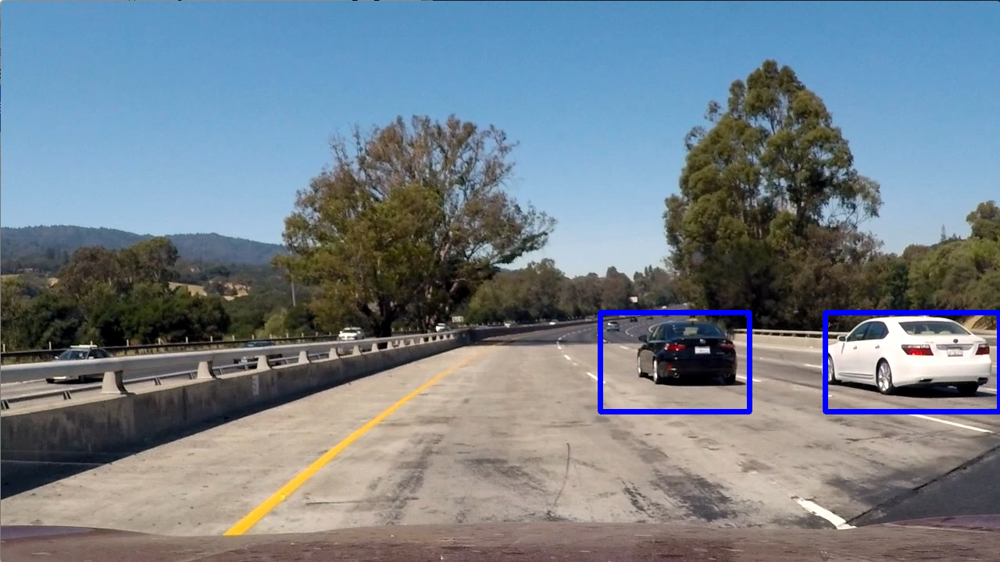

## Vehicle Detection Project 

**Vehicle Detection Project**

The goal of this project was to find cars in a video feed from a dash mounted camera, and draw bounding boxes around them. 

The steps taken to achieve this goal were the following:

* Perform a Histogram of Oriented Gradients (HOG) feature extraction on a labeled training set of images and train a classifier Linear SVM classifier
* Apply a color transform and append binned color features, as well as histograms of color, to the HOG features vector. 
* Implement a sliding-window technique and use the trained classifier to search for vehicles in images.
* Estimate bounding boxes for vehicles detected.

The final result in a sample video can be seen below:

Additionally, a YOLO based pipeline with a pre-trained model was implemented as a reference of a deep learning approach:

## Implementation details

### Classifier

A set of labelled images of `vehicle` and `non-vehicle` was used to train a linear SVM classifier (code in `classifier_training.py`).

The initial dataset was latter augmented with additional samples from different road patches and road color transitions, to reduce the number of false positives:
  

The input for the classifier was a set of features extracted from the images including:

* Histogram of Oriented Gradients (HOG) features (lines 14 to 28 of `car_classifier.py`)
* Spatial features (pixels from a resized image).
* Histogram features (counts from a per-channel histogram of the image).

#### Choice of classifier parameters.

In order to apply a systematic approach, the classifier was implemented complying with the sklearn BaseEstimator interface, allowing for the use of automated parameter selection tools. 

GridSearchCV was used to select among the following parameter options:

* Colorspace: RGB, LUV, HLS, YCrCb
* Channels explored for HOG features (each individual channel, or all of them)
* Pixels per cell: 4,8,16 
* Cells per block: 2,4,6 
* Orientation bins: 8,9,11
* Size of image for spatial features: (16,16),(32,32),(64,64)
* Number of bins for histogram features:16,32,64
* Include spatial features?: Yes, No
* Include histogram features?: Yes, No

The full seach of this parameter space would be too computationally expensive, so several partial searches were performed, focusing first on the HOG parameters (colorspace, channels, pixels per cell, cells per bock and orientation bins), and then on the rest. Therefore, some potential interactions might have been ignored. 

The final choice of parameters was the following:

* Colorspace: YCrCb
* Channels explored for HOG features: All 
* Pixels per cell: 8
* Cells per block: 2
* Orientation bins: 8
* Size of image for spatial features: (32,32)
* Number of bins for histogram features: 32
* Include spatial features?: Yes
* Include histogram features?: Yes

### Sliding Window Search

To identify vehicles in an image, a sliding window search was implemented (from line 113 of `car_classifier.py`). This means the classifier is run in many patches from the original.

Two searches are performed for each frame (line 123 in `vehicle_detection_pipeline.py`)). A wider one, in the area contained in the blue rectangle, with scale=2 (searching in 128x128px image patches), and 75% overlap, plus another focused on the further part of the frame (red box), with scale=1 and also 75% overlap.

This approach was the result of a lot of trial and error, balancing the detection performance and speed. Some of the discarded approaches were:

* Larger and smaller scales (from 0.5 in the furthest part to 4 to detect cars in the adyacent lanes). 
* Overlapping and non-overlapping search areas for different scales. Non-overlapping areas caused issues in the scale transition.
* Fixed search areas in the edges of the frame, and the horizon, to detect new cars, and variable areas around previous detections, to follow cars through the frame.

#### Test images

Here are some example images:

This single frame performance is not directly extrapolable to a video stream, as two inter-frame smoothing was applied in two cases:

 * Frames heatmap, to allow detections to stick for a bit in case the classifier misses one frame. (line 116 in `vehicle_detection_pipeline.py`)
 * Corners of the boxes drawn. They are compared to those drawn on the previous frame, and for boxes intersecting, the corners are smoothed to avoid jitter. (line 80 in `vehicle_detection_pipeline.py`)

A third method was tried, to keep drawing for a few frames boxes that are no longer detected.(line 91 in `vehicle_detection_pipeline.py`) It is currently inactive (line 70, `max_age=1`), as it's main impact was providing persistence to false detections.

#### Final bounding box estimation

I recorded the positions of positive detections in each frame of the video (line 129 in `vehicle_detection_pipeline.py`).  From the positive detections I created a heatmap and then thresholded that map to identify vehicle positions.  I then used `scipy.ndimage.measurements.label()` to identify individual blobs in the heatmap. 
Exponential smoothing was applied with this heatmap for consecutive frames (line 116 in `vehicle_detection_pipeline.py`). In the resulting heatmap  I then assumed each blob corresponded to a vehicle.  I constructed bounding boxes to cover the area of each blob detected.  

Here's an example result showing the heatmap from a series of frames of video, the result of `scipy.ndimage.measurements.label()` and the bounding boxes then overlaid on the last frame of video:

#### Here are six frames their corresponding heatmaps, and the output of `scipy.ndimage.measurements.label()` on the  heatmap :

#### Here the resulting bounding boxes are drawn onto the last frame in the series:

### Sample video

### Discussion

Fine tuning detection with this approach can be difficult, as if the pipeline does not perform as expected, there are lots of changes that could be made, often with unpredictable results (from too much detections to too few, from too big boxes to too small). 

As I'm partial for Deep Learning based solutions. I tried to apply a YOLOv2 based classifier (implemented in a different course) with no optimizations for this particular video, and blind search for each frame, and [the results were almost perfect](https://youtu.be/Sz4yrw2QUgA) out of the box: 

I can identify lots of areas for improvement, if I were to continue working on this project: 

* Train the classifier with a better selection of images, as it still has some false positives in areas it shouldn't. 
* Keep trying different search window layouts. Small variations have a great impact on the final result, so there might be different layouts with better performance. 
* Work on a better solution when bounding boxes join and split. 

However, given the results of the deep learning classifier, I think improving it would be the best path forward. It's current implementation is slower than my HOG classifier (that's still far from running on real time in a CPU), but it runs on real time in a GPU, and there are lots of optimizations that could be applied, running the classifier on a portion of the image, only  once every n frames, keeping track of detections, etc. 

---

This project was completed for the Udacity Self Driving Car Nanodegree 
