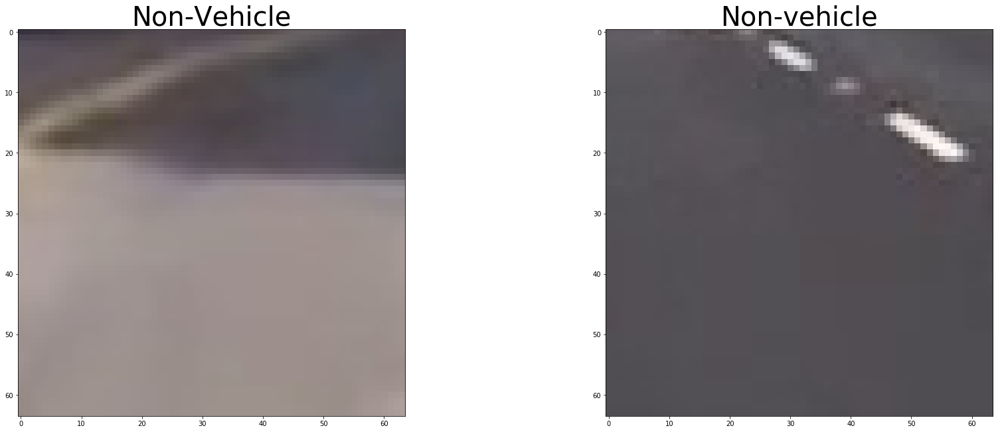
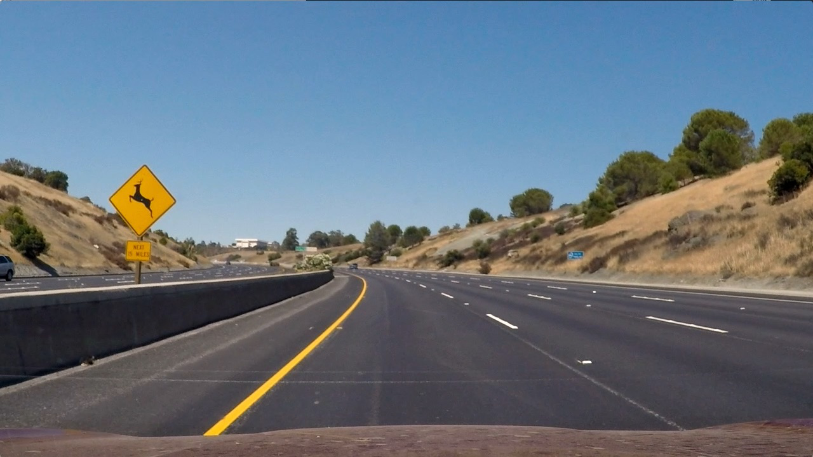
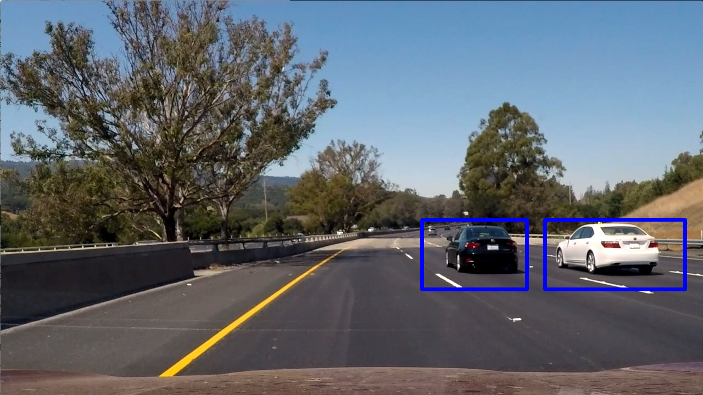
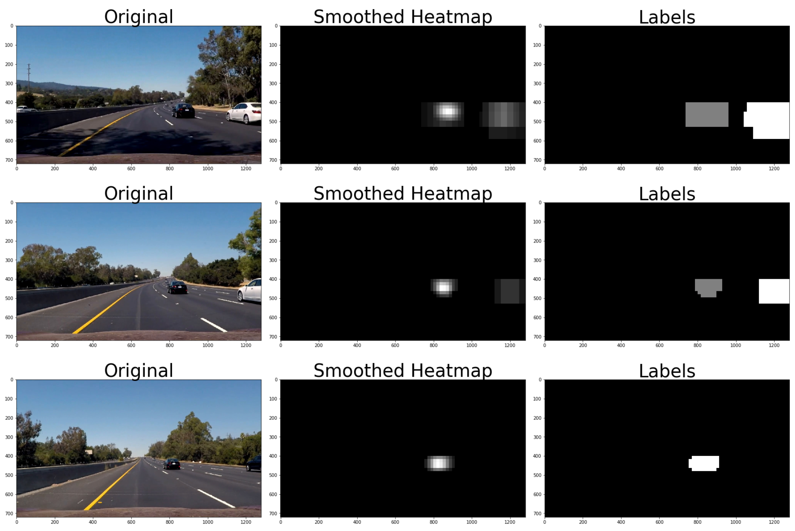
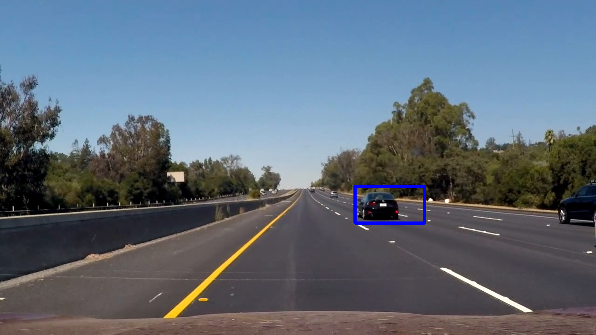

## Vehicle Detection Project 

**Vehicle Detection Project**

The goals / steps of this project are the following:

* Perform a Histogram of Oriented Gradients (HOG) feature extraction on a labeled training set of images and train a classifier Linear SVM classifier
* Optionally, you can also apply a color transform and append binned color features, as well as histograms of color, to your HOG feature vector. 
* Note: for those first two steps don't forget to normalize your features and randomize a selection for training and testing.
* Implement a sliding-window technique and use your trained classifier to search for vehicles in images.
* Run your pipeline on a video stream (start with the test_video.mp4 and later implement on full project_video.mp4) and create a heat map of recurring detections frame by frame to reject outliers and follow detected vehicles.
* Estimate a bounding box for vehicles detected.

## [Rubric](https://review.udacity.com/#!/rubrics/513/view) Points
### Here I will consider the rubric points individually and describe how I addressed each point in my implementation.  

---
### Writeup / README

#### 1. Provide a Writeup / README that includes all the rubric points and how you addressed each one.  You can submit your writeup as markdown or pdf.  [Here](https://github.com/udacity/CarND-Vehicle-Detection/blob/master/writeup_template.md) is a template writeup for this project you can use as a guide and a starting point.  

You're reading it!

### Histogram of Oriented Gradients (HOG)

#### 1. Explain how (and identify where in your code) you extracted HOG features from the training images.

The code for the classifier training is in the file called `classifier_training.py`. HOG feature extraction id perfomed in lines 14 to 28 of `car_classifier.py`. 

I started by reading in all the `vehicle` and `non-vehicle` images.  Here is an example of one of each of the `vehicle` and `non-vehicle` classes:

The initial dataset was latter augmented with additional samples from different road patches and road color transitions, to reduce the number of false positives:
  

#### 2. Explain how you settled on your final choice of HOG parameters.

In order to apply a systematic approach, the classifier was implemented complying with the sklearn BaseEstimator interface, allowing for the use of automated parameter selection tools. 

GridSearchCV was used to select among the following parameter options:

* Colorspace: RGB, LUV, HLS, YCrCb
* Channels explored for HOG features (each individual channel, or all of them)
* Pixels per cell: 4,8,16 
* Cells per block: 2,4,6 
* Orientation bins: 8,9,11
* Size of image for spatial features: (16,16),(32,32),(64,64)
* Number of bins for histogram features:16,32,64
* Include spatial features?: Yes, No
* Include histogram features?: Yes, No

The full seach of this parameter space would be too computationally expensive, so several partial searches were performed, focusing first on the HOG parameters (colorspace, channels, pixels per cell, cells per bock and orientation bins), and then on the rest. Therefore, some potential interactions might have been ignored. 

The final choice of parameters was the following:

* Colorspace: YCrCb
* Channels explored for HOG features: All 
* Pixels per cell: 8
* Cells per block: 2
* Orientation bins: 8
* Size of image for spatial features: (32,32)
* Number of bins for histogram features: 32
* Include spatial features?: Yes
* Include histogram features?: Yes

#### 3. Describe how (and identify where in your code) you trained a classifier using your selected HOG features (and color features if you used them).

The classifier's fit function (line 88 in `car_classifier.py`) extracts the features from the provided images, scales them, and uses a sklearn linear SVM classifier.

### Sliding Window Search

#### 1. Describe how (and identify where in your code) you implemented a sliding window search.  How did you decide what scales to search and how much to overlap windows?

The sliding window search is implemented inside the car_classifier object, from line 113 of `car_classifier.py`. This approach ensures classification is done with the parameters used in training.
Two searches are performed for each frame (line 123 in `vehicle_detection_pipeline.py`)). A wider one, in the area contained in the blue rectangle, with scale=2 (searching in 128x128px image patches), and 75% overlap, plus another focused on the further part of the frame (red box), with scale=1 and also 75% overlap.

This approach was the result of a lot of trial and error, balancing the detection performance and speed. Some of the discarded approaches were:

* Larger and smaller scales (from 0.5 in the furthest part to 4 to detect cars in the adyacent lanes). 
* Overlapping and non-overlapping search areas for different scales. Non-overlapping areas caused issues in the scale transition.
* Fixed search areas in the edges of the frame, and the horizon, to detect new cars, and variable areas around previous detections, to follow cars through the frame.

#### 2. Show some examples of test images to demonstrate how your pipeline is working.  What did you do to optimize the performance of your classifier?

Here are some example images:

This single frame performance is not directly extrapolable to a video stream, as two inter-frame smoothing was applied in two cases:
 * Frames heatmap, to allow detections to stick for a bit in case the classifier misses one frame. (line 116 in `vehicle_detection_pipeline.py`)
 * Corners of the boxes drawn. They are compared to those drawn on the previous frame, and for boxes intersecting, the corners are smoothed to avoid jitter. (line 80 in `vehicle_detection_pipeline.py`)

A third method was tried, to keep drawing for a few frames boxes that are no longer detected.(line 91 in `vehicle_detection_pipeline.py`) It is currently inactive (line 70, `max_age=1`), as it's main impact was providing persistence to false detections.

---

### Video Implementation

#### 1. Provide a link to your final video output.  Your pipeline should perform reasonably well on the entire project video (somewhat wobbly or unstable bounding boxes are ok as long as you are identifying the vehicles most of the time with minimal false positives.)
Here's a [link to my video result](./output_videos/project_video.mp4)

#### 2. Describe how (and identify where in your code) you implemented some kind of filter for false positives and some method for combining overlapping bounding boxes.

I recorded the positions of positive detections in each frame of the video (line 129 in `vehicle_detection_pipeline.py`).  From the positive detections I created a heatmap and then thresholded that map to identify vehicle positions.  I then used `scipy.ndimage.measurements.label()` to identify individual blobs in the heatmap. 
Exponential smoothing was applied with this heatmap for consecutive frames (line 116 in `vehicle_detection_pipeline.py`). In the resulting heatmap  I then assumed each blob corresponded to a vehicle.  I constructed bounding boxes to cover the area of each blob detected.  

Here's an example result showing the heatmap from a series of frames of video, the result of `scipy.ndimage.measurements.label()` and the bounding boxes then overlaid on the last frame of video:

### Here are six frames their corresponding heatmaps, and the output of `scipy.ndimage.measurements.label()` on the  heatmap :

### Here the resulting bounding boxes are drawn onto the last frame in the series:

---

### Discussion

#### 1. Briefly discuss any problems / issues you faced in your implementation of this project.  Where will your pipeline likely fail?  What could you do to make it more robust?

To be honest, this project was quite a frustrating experience for me, to the point it made me consider leaving the nanodegree. When the pipeline was not performing as expected, there were lots of changes that could be made, often with unexpected results (from too much detections to too few, from too big boxes to too small). Given the amount of fine-tuning it required to get OK performance on a particular video, I'm of the impression that I was in a way 'overfitting'. 

I have to admit that I'm partial for Deep Learning based solutions. I tried to apply a YOLOv2 based classifier (implemented in a different course) with no optimizations for this particular video, and no data kept between frames, and [the results were almost perfect](./output_videos/project_video.mp4) out of the box.

My final implementation does not use that many windows, but still, it's far from being able to work in real time. 

I can identify lots of areas for improvement, if I were to continue working on this project: 

* Train the classifier with a better selection of images, as it still has some false positives in areas it shouldn't. 
* Keep trying different search window layouts. Small variations have a great impact on the final result, so there might be different layouts with better performance. 
* Work on a better solution when bounding boxes join and split. 

